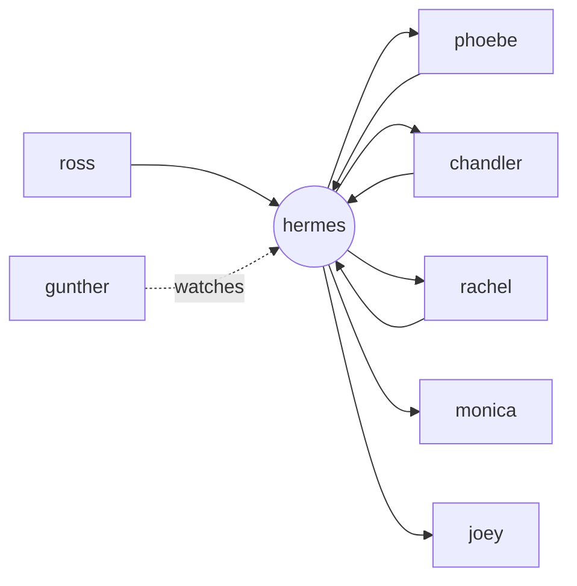

# the friends framework

a marketing team as ai agents. six specialists do the work, one operator moves it
between them, one watchdog checks it's still running. named after friends
characters so you remember which one does what.

the [17-page guide](the-friends-framework.pdf) is the walkthrough. this repo is
the same thing as files you can copy.

## who this is for

- you run marketing — solo or a small team — and you're building with ai
- you've got one prompt trying to do everything and it's getting worse, not better
- you want a structure you can explain to a client without a whiteboard

not for: teams who need a full mlops setup, or anyone after a no-code tool. this
is a way of organising agents, not software.

## the team

| agent | job | one line |
|---|---|---|
| **ross** | research | finds what to react to. runs on a timer, hands phoebe a short brief. |
| **phoebe** | strategy | picks the one claim worth making and writes the brief. |
| **chandler** | copy | writes everything that ships, then edits the ai out of it. |
| **rachel** | design | lays it out so it looks like one brand made it. |
| **joey** | outreach | writes to one real person at a time. cold message to booked call. |
| **monica** | ops + dms | schedules, answers dms, checks every claim. last one to touch it. |
| **hermes** | operator | passes work between the six, runs the timers, sends one daily brief. |
| **gunther** | watchdog | checks the work is actually happening. pings you when it isn't. |

full write-ups in [`agents/`](agents/).

## how the work moves

every hand-off goes through hermes. the specialists never call each other
directly. that's what stops a broken agent taking three others down with it, and
what lets you trace a bad output back to one step.

three routes through the team:

- **content** — ross to phoebe to chandler + rachel to monica
- **leads** — ross to chandler + rachel to joey to monica
- **inbound** — monica reads every dm, sends real enquiries to joey

## the three files every agent loads

before an agent starts a task it reads these, in order:

1. **[`templates/rules.md`](templates/rules.md)** — what no agent may do. brand lines, legal limits, the actions that need a human. shared by all of them.
2. **[`templates/context.md`](templates/context.md)** — who you are, who you serve, what you sell. shared by all of them.
3. **the task file** — how to do this one job. one per agent, in [`agents/`](agents/). the only file that differs between them.

## build order

don't stand up eight agents in a weekend. you'll have eight half-built ones on monday.

1. build the one for whatever's eating your week — usually chandler or ross. give it the three files. use it two weeks.
2. add a second, and write down exactly what the first hands to it.
3. at three agents, add hermes. before that, routing by hand is fine.
4. at five or six, add gunther — you can't watch it all yourself any more.

most people stop at three or four. the full eight is an agency.

## use it

1. copy [`templates/agent-role.md`](templates/agent-role.md)
2. fill it in for one job. one page.
3. drop it next to `rules.md` and `context.md` in whatever runs your agents — claude code, a custom loop, an orchestration tool

there's a filled-in set in [`examples/chandler-glow-lab/`](examples/chandler-glow-lab/):
chandler, wired up for a made-up skincare brand, so you can see what the three
files look like when they're not blank.

## the mistakes to avoid

- one new agent per idea, until there are twelve and no system
- skipping the rules file until an agent says something you can't back
- letting agents trigger each other directly
- full auto on anything that publishes
- one model for every task

---

by [@getgitgirl](https://instagram.com/getgitgirl) · [getgitgirl.framer.ai](https://getgitgirl.framer.ai)

[MIT](LICENSE) — use it, change it, ship it.
