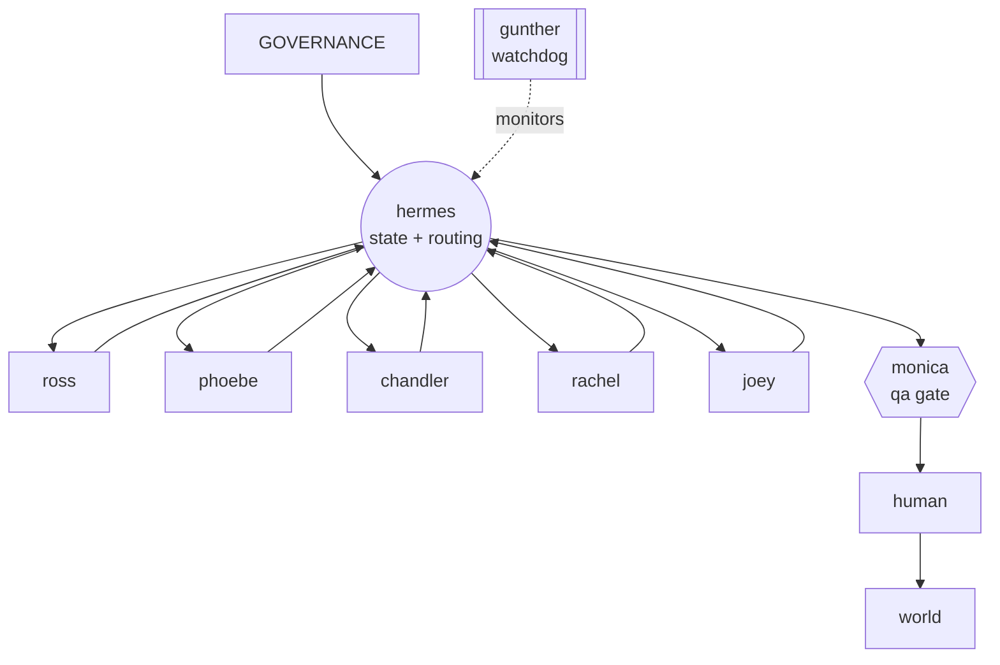

# the friends framework

a marketing team as ai agents. six specialists do the work, one operator moves it
between them, one watchdog checks it's still running. named after friends
characters so you remember which one does what.

more precisely: **specialised ai roles working on shared artifacts, behind
human-controlled gates, with an operator that holds state and a watchdog that
monitors it.** the "team" framing is the on-ramp; the sentence above is what it
actually is.

the [guide](the-friends-framework.pdf) is the walkthrough. this repo is the
operating model as files you can copy: the governance block every role loads,
the eight skills, the qa layer, the outreach system.

## who this is for

- you run marketing — solo or a small team — and you're building with ai
- you have one prompt trying to do everything and it's getting worse, not better
- you want a structure you can explain to a client without a whiteboard

not for: teams who need a full mlops setup, or anyone after a no-code tool. this
is a way of organising agents, not software.

## the team

| agent | job | file |
|---|---|---|
| **ross** | research — finds true, current, sourced signal | [agents/ross.md](agents/ross.md) |
| **phoebe** | strategy — the angle, the brief, the argument against | [agents/phoebe.md](agents/phoebe.md) |
| **chandler** | copy — writes it, then edits the ai out | [agents/chandler.md](agents/chandler.md) |
| **rachel** | design — makes it look like one brand made it | [agents/rachel.md](agents/rachel.md) |
| **joey** | outreach — one real person at a time | [agents/joey.md](agents/joey.md) |
| **monica** | ops + qa + dms — the gate | [agents/monica.md](agents/monica.md) |
| **hermes** | operator — routes hand-offs, holds state | [agents/hermes.md](agents/hermes.md) |
| **gunther** | watchdog — checks the work is happening | [agents/gunther.md](agents/gunther.md) |

**six roles, two controls.** ross, phoebe, chandler, rachel, joey and monica's
*production* work are the roles. monica's *gate* and gunther are control
mechanisms, not extra workers — one stops anything that fails a check, the other
stops anything that stalls. hermes isn't a role either; it's routing and state,
and it could eventually be a deterministic engine rather than a model.

## what every role loads, in order

```
GOVERNANCE.md   →   context.md   →   rules.md   →   the role's skill   →   the task
```

- **[GOVERNANCE.md](GOVERNANCE.md)** — the five non-negotiables. never invent
  facts. nothing external without the gate. escalation is success. run the spec's
  checks. corrections are permanent. same block for every role.
- **[context.md](templates/context.md)** — who you are, who you serve, what you
  sell. shared.
- **[rules.md](templates/rules.md)** — what no role may do: brand lines, your
  industry's rules, the claimable set. shared.
- **the skill** — how to do this one job. it carries the judgement, written as if
  the model has none: role, taste rules, a worked *excellent* example, the
  *mediocre* slop spelled out, three hard refusals, escalation triggers. the
  eight worked skills are in [`agents/`](agents/); the blank template is
  [`templates/skill.md`](templates/skill.md). some skills also pull in a shared
  spec — monica's runs [`qa/gauntlet.md`](qa/gauntlet.md), joey's runs
  [`outreach/archetype-system.md`](outreach/archetype-system.md).

hermes and gunther are the exception: they don't produce content, so they load
only `GOVERNANCE.md` plus their own file. hermes then works from the routing
table; gunther from its health checks.

## how the work moves



the roles never hand to each other. a role finishes, writes its output and its
check table into the task, sets a status, and stops. **hermes** reads the status
and sends it to exactly one next owner — it's the only thing that holds workflow
state. nothing reaches the world except through **monica's gate** and a human's
yes. **gunther** sits outside the flow and watches that it keeps moving.

three routes through the team:

- **content** — ross → phoebe → chandler + rachel → monica → human
- **leads** — ross → chandler + rachel → joey → monica → human
- **inbound** — monica reads every dm; real enquiries go to joey

## the qa gauntlet

monica runs [qa/gauntlet.md](qa/gauntlet.md) on every external-facing artifact
before it reaches a human. checks are ordered cheapest-and-most-fatal first, each
one a scan or a count (no judgement), and they **stop at the first fail** —
returned to the author, never fixed in place. source integrity, compliance
screen, false-authority screen, voice-tell scan, promise ledger, example-per-
slide, hook placement, recipient safety.

and the escalation rule: seven triggers where guessing is banned, plus the
standing asymmetry. *a held artifact costs a day; a wrong one costs the
reputation the whole business runs on.*

## roles, agents, models: three things

- a **role** is a job (research, strategy, copy).
- an **agent** is a running thing bound to a role. it can be a cron job and a
  script, an orchestrator node, or just a scheduled model call. it does not have
  to be an always-on autonomous process.
- a **model** is the llm behind it. one model can serve several roles with
  different context. some roles want a different model or different tools (ross
  needs a scraper; phoebe needs your best reasoning model).

so you don't need eight permanent processes. hermes can invoke a role as a
function: load governance + context + rules + that skill + the task, call the
model, write the output back, set the status.

## build order

don't stand up eight agents in a weekend. you'll have eight half-built ones on monday.

1. build the one for whatever's eating your week — usually chandler or ross. give
   it the four files. run it two weeks.
2. add a second, and write down exactly what the first hands to it.
3. at three agents, add hermes. before that, routing by hand is fine.
4. at five or six, add gunther — you can't watch it all yourself any more.

most people stop at three or four. the full eight is an agency.

## does it actually beat one good agent?

multi-agent systems have a nasty failure mode: an elaborate machine producing the
same mediocre output at five times the token cost. before you trust this over a
single well-designed agent, run the test. put the same twenty briefs through
each, blind-rate the outputs, log the tokens from your router, count the reworks:

| setup | output quality (1–5, blind) | human min / piece | tokens / piece | reworks per 20 |
|---|---|---|---|---|
| one well-designed agent | | | | |
| three roles (research → strategy → copy) | | | | |
| the full framework | | | | |

if the framework doesn't move quality or cut your time, don't run it.

## use it

1. copy [templates/agent-role.md](templates/agent-role.md), sketch one job
2. write its [skill](templates/skill.md) — the excellent/mediocre examples are
   the point; don't skip them
3. drop it next to `GOVERNANCE.md`, `context.md`, `rules.md` in whatever runs
   your agents

worked example: [examples/chandler-glow-lab/](examples/chandler-glow-lab/) —
chandler wired up for a made-up skincare brand, with the excellent-vs-mediocre
pair written out.

---

adapted from a private agent-team spec into a general framework by
[@getgitgirl](https://instagram.com/getgitgirl) ·
[getgitgirl.framer.ai](https://getgitgirl.framer.ai)

[MIT](LICENSE)
